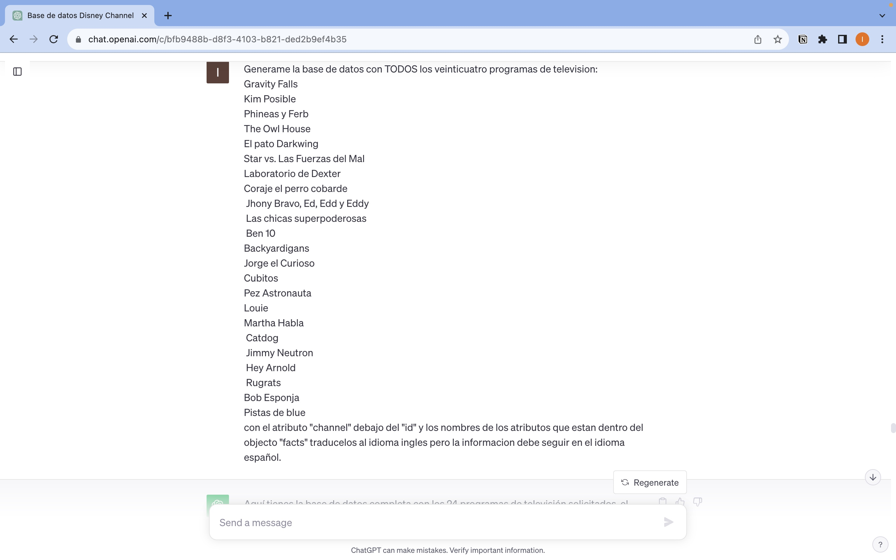
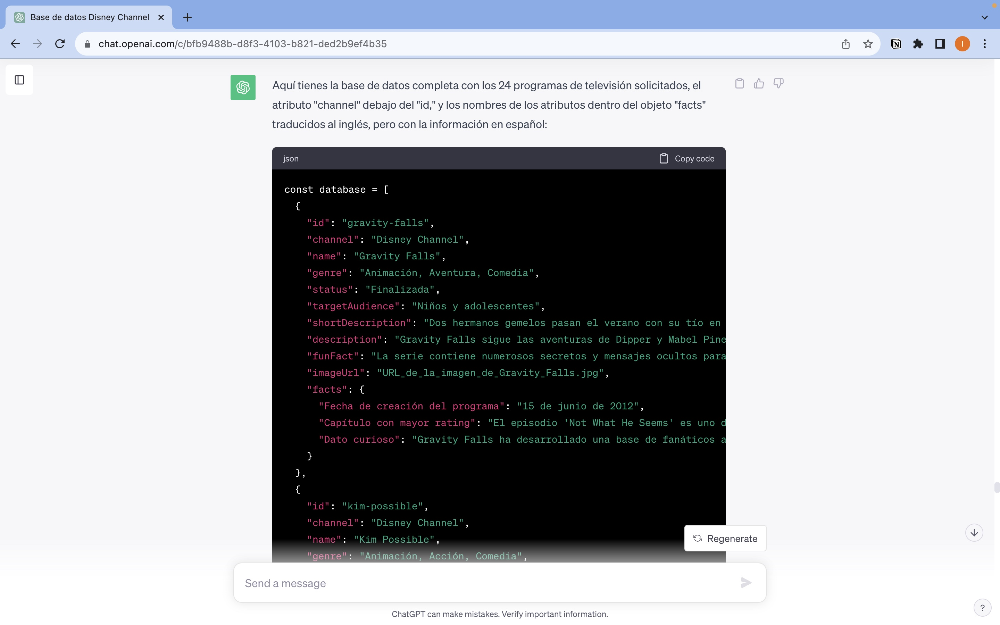
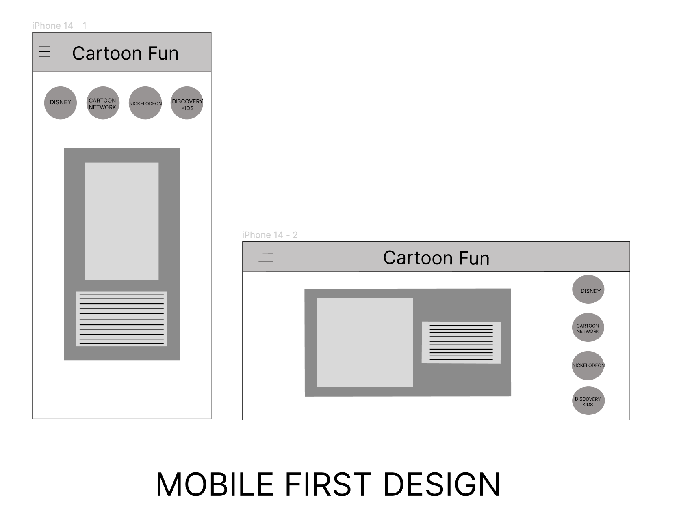
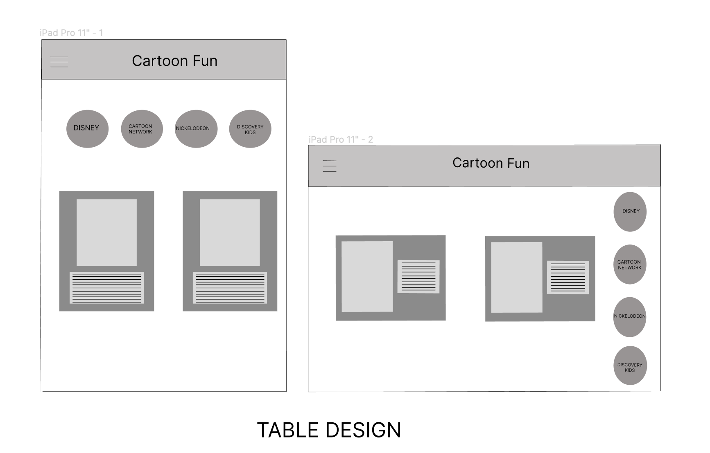
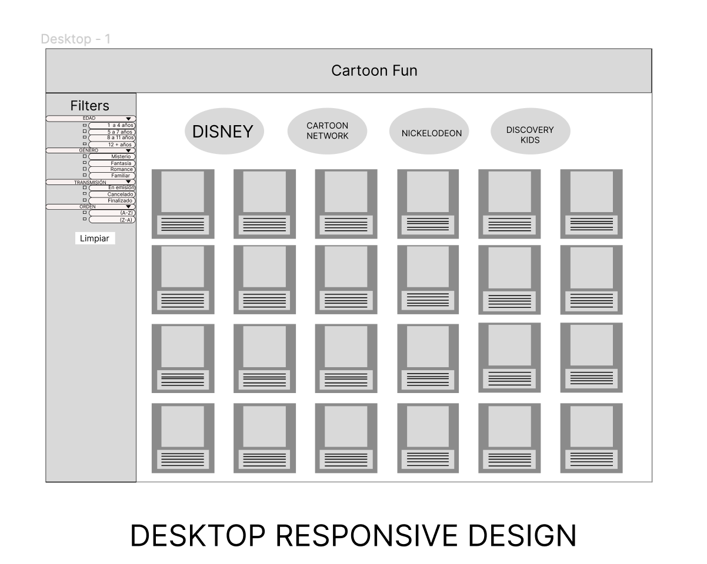

# README

# Cartoon Fun

## Índice

- [1. Preámbulo](#1-preámbulo)
- [2. Resumen del proyecto](#2-resumen-del-proyecto)
- [3. Información general](#3-informacion-general)
- [4. Funcionalidades](#4-funcionalidades)
- [5. Información técnica](#5-informacion-tecnica)
- [6. Maquetación del proyecto](#6-maquetacion-del-proyecto)
- [7. Herramientas](#7-herramientas)
- [8. Autoras](#8-autoras)
---

## 1. Preámbulo

Según [Forbes](https://www.forbes.com/sites/bernardmarr/2018/05/21/how-much-data-do-we-create-every-day-the-mind-blowing-stats-everyone-should-read),
el 90% de la data que existe hoy ha sido creada durante los últimos dos años.
Cada día generamos 2.5 millones de terabytes de datos, una cifra sin
precedentes.

No obstante, los datos por sí mismos son de poca utilidad. Para que esas
grandes cantidades de datos se conviertan en **información** fácil de leer para
las usuarias, necesitamos entender y procesar estos datos. Una manera simple de
hacerlo es creando *interfaces* y *visualizaciones*.

## 2. Resumen del proyecto

En este proyecto **se construyo una *página web* para visualizar un
*conjunto (set) de datos*** que se generaron con [prompting](https://www.itmadrid.com/que-es-un-prompt-en-inteligencia-artificial-ia/).

En este proyecto se utilizó la herramienta de
[inteligencia artificial](https://es.wikipedia.org/wiki/Inteligencia_artificial)
 [ChatGPT](https://openai.com/chatgpt), 
para generar un set de datos.

El propósito de generar los datos en esta manera es aprovechar la oportunidad de emplear las herramientas impulsadas por la inteligencia
artificial, así como [técnicas de
prompting](https://learnprompting.org/es/docs/intro).

Como entregable final se tiene una página web que permite **visualizar la data,
filtrarla, ordenarla y calcular una estadística**. 

## 3. Información general

- Este proyecto se trabajó en duplas.
- El rango de tiempo estimado para completar el proyecto fue de 3 a 5 Sprints.
- El proyecto fue entregado subiendo el código a GitHub (commit/push) y la
interfaz fue desplegada usando [GitHub Pages](https://pages.github.com/).

## 4. Funcionalidades

Aquí definimos en más detalle las funcionalidades mínimas que tiene:

- La aplicación permite al usuari@ ver los items de la data en una visualización,
que es en tipo tarjetas.

- Las tarjetas contienen los valores de las propiedades de la data que
le interesaría al usuari@ ver. Se observa: nombre, fecha, imagen, etc.

- La interfaz esta estructurada semánticamente usando el estándar microdatos
Usa los atributos :`[itemscope]`,
`[itemtype]` y `[itemprop]`.
    
    
- En la aplicación se puede visualizar una estadística global de la data (total de caricaturas por cada canal).
- La aplicación tiene un **multifiltro** que le permite al usuari@ filtrar la data por `canal`,  `estado de transmisión` y `público dirigido`. 

- La aplicación permite al usuari@ ordenar la data alfabeticamente (ascendente y descente).
 
- Las funcionalidades se mantienen sobre la data filtrada.
Por ejemplo, si filtro las caricaturas por canal y luego los ordeno por
nombre ascendentemente, la aplicación mantiene el filtro aplicado y
ordenar las caricaturas.
- La aplicación permite al usuari@ reiniciar la aplicación, limpiando
filtros y ordenamiento sin recargar
la página, si no que agrega el contenido de manera
dinámica via javascript.

- La aplicación es *responsive*, es decir, se visualiza sin problemas
desde distintos tamaños de pantallas: `móviles`, `tablets` y `desktops`.

## 5. Información técnica

La lógica del proyecto fue implementada completamente en JavaScript
(ES6), HTML y CSS. En este proyecto NO se usó librerías o
frameworks, solo vanilla JavaScript.

## 6. Proceso del proyecto

### Metodologías ágiles utilizadas (Trabajo Colaborativo)

En este proyecto se utilizaron las siguientes metodologías que permitieron un óptimo desempeño durante el trabajo en equipo:

- [SCRUM](https://www.atlassian.com/es/agile/scrum)
- [KANBAN](https://www.atlassian.com/es/agile/kanban)

### Historias de usuario

Se realizó la Historia de Usuari@ que representa lo que se necesita hacer/ver en la página web.

La historia de usuari@ nos permitió tener una guia en la planificacion de los sprints dividiendola en tareas.

### Generación de datos & Prompt utilizado

En este proyecto con la ayuda de la inteligencia artificial `ChatGPT` se generó una data de 24 objetos, con la temática de Caricaturas infantiles la cual contiene las siguientes propiedades: `Imagen`, `Nombre`, `Estado de transmisión`, `Público dirigido`, `Género`, `Descripción corta`, `Hechos` que incluye (`Fecha de creación del programa`, `Rating` y `Dato curioso`)

### Prototipo de alta fidelidad & Diseño Responsive

Se utilizó una herramienta de diseño visual (Figma) para crear los prototipos considerando que este debe ser un Diseño Responsive. 

### Pruebas unitarias

Este proyecto no incluian las Pruebas Unitarias (*tests*), así que se crearon con el framework Jest, especificamente para las funciones encargadas de  *procesar*,
*filtrar* y *ordenar* la data, así la de *calcular* estadísticas.

Las *pruebas unitarias*  dan una cobertura del 100% de *statements*
(*sentencias*), *functions* (*funciones*), *lines* (*líneas*), y *branches*
(*ramas*) del archivo `src/dataFunctions.js` que contiene las funciones.

## 7. Herramientas

- [Git](https://git-scm.com/)
- [GitHub](https://github.com/)
- [GitHub Pages](https://pages.github.com/)
- [Node.js](https://nodejs.org/)
- [Jest](https://jestjs.io/)
- [Visual Code Studio](https://code.visualstudio.com/)

## 8. Autoras
*Isis Marina Daza Peña*

*Rosario Trillo Allende*